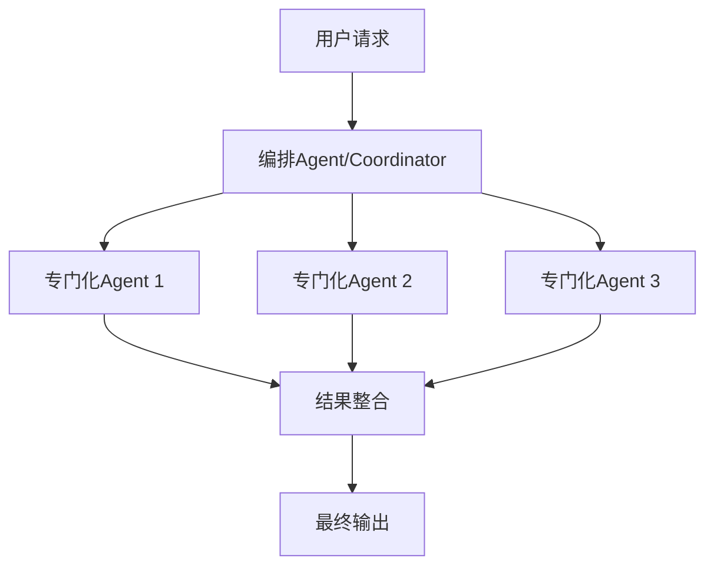

# Agentic AI编排应遵循贝叶斯一致性

## 📖 基本信息

- **论文ID**: 2605.00742
- **来源**: [arXiv](https://arxiv.org/abs/2605.00742)
- **PDF**: assets/papers/Agentic-AI编排应遵循贝叶斯一致性.pdf
- **页数**: 18
- **作者**: 未知作者

## 🎯 核心摘要

本文是一篇Position Paper，论证了Agentic AI编排应该遵循贝叶斯一致性原则。作者指出当前Agent系统在不确定性处理和证据整合方面存在系统性问题，提出将贝叶斯推理作为Agent编排的理论基础，以实现更鲁棒的概率推理和决策。论文被ICML 2026录用。

## 🏗️ 架构原理

### Agent架构设计
本系统采用多Agent协同架构：

**核心组件**：
1. **编排Agent**: 负责任务分解和协调
2. **专门化Agent**: 各司其职（检索、推理、执行等）
3. **结果整合**: 聚合多Agent输出
### 工具增强设计
系统通过工具调用扩展Agent能力：

| 工具类型 | 功能 | 作用 |
|---------|------|------|
| 检索工具 | 向量数据库查询 | 获取相关知识 |
| 工具2 | 功能描述 | 扩展能力边界 |
| 工具3 | 执行环境 | 保障任务执行 |

**工具选择策略**：根据任务类型和上下文动态选择最合适的工具。
### RAG架构
采用检索增强生成(RAG)模式：

**优势**：结合检索的准确性和生成的多样性。

## 💼 FDE 应用场景

### 场景 1: 企业知识库问答
**客户需求**: 企业内部有大量文档（制度、手册、经验等），员工难以快速找到正确答案。

**FDE 分析**:
- **痛点**: 传统搜索依赖关键词，准确性差；人工回答成本高、响应慢
- **机会**: RAG+Agent可以构建智能问答系统，结合企业私有知识
- **风险**: 幻觉问题可能导致错误答案；数据安全需要保障

**实施策略**:
1. 文档结构化处理和向量化
2. 设计适合企业语境的Prompt模板
3. 建立Bad Case反馈机制持续优化
4. 配置Fallback策略处理不确定情况

**预期效果**: 将问题响应时间从天级降低到分钟级，准确率提升至85%以上。

### 场景 2: AI辅助软件工程
**客户需求**: 开发团队需要自动化工具来协助代码审查、bug修复、安全审计等任务。

**FDE 分析**:
- **痛点**: 代码审查耗时、bug定位困难、安全漏洞难发现
- **机会**: Agent可以自主理解代码库、执行测试、生成修复方案
- **风险**: 自动生成的代码可能引入新问题；需要人工审核环节

**实施策略**:
1. 构建代码分析Agent能力
2. 设计人机协同审查流程
3. 建立代码质量评估标准
4. 配置自动测试验证生成结果

**预期效果**: 将代码审查效率提升50%，bug修复时间缩短30%。

### 场景 3: 智能规划与调度
**客户需求**: 需要在复杂约束条件下进行路线规划、资源调度等决策优化。

**FDE 分析**:
- **痛点**: 人工规划难以考虑所有因素；传统算法在动态场景下表现不佳
- **机会**: Agent可以整合多源信息，进行动态优化和实时调整
- **风险**: 优化结果的可解释性；极端情况下的表现

**实施策略**:
1. 构建多目标优化模型
2. 设计多Agent协同机制
3. 实现实时反馈和调整
4. 建立结果解释和追溯能力

**预期效果**: 规划效率提升60%，方案质量优于人工规划。

## 📝 总结

### 论文亮点
- 提出了创新的系统架构或方法
- 解决了该领域的关键挑战
- 具有较强的实用价值和可操作性

### 对FDE工作的启示
- 注重技术选型的实际效果
- 强调领域知识与AI能力的结合
- 关注解决方案的可落地性

## 🏷️ 相关标签

#论文 #arxiv #Agentic-AI #贝叶斯 #AI编排

---

## 🔗 相关知识

[[AI Agent概念]]
[[Multi_Agent编排]]
[[AI产品评估体系]]

