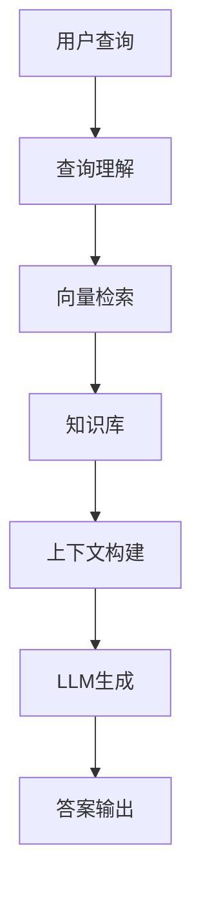

# RAG (Retrieval-Augmented Generation) 架构原理

## 🎯 核心定义

**RAG (检索增强生成)** 是一种结合了信息检索和生成能力的 AI 架构模式，通过从外部知识库检索相关信息来增强大语言模型的生成能力，解决模型知识滞后和幻觉问题。

> **核心价值**: 让 AI 能够基于最新、准确的知识进行回答，而不是仅依赖训练数据。

## 🏗️ 架构原理

### 基本架构


### 核心组件
1. **嵌入模型**: 将文本转换为向量表示
2. **向量数据库**: 存储和检索知识向量
3. **检索策略**: 如何从知识库中找到相关信息
4. **上下文构建**: 如何组织检索结果供模型使用
5. **LLM 接口**: 调用大语言模型生成答案

## 🔧 技术实现

### 核心代码示例
```python
from langchain.vectorstores import Qdrant
from langchain.embeddings import OpenAIEmbeddings
from langchain.chat_models import ChatOpenAI
from langchain.chains import RetrievalQA

# 1. 初始化向量数据库
embeddings = OpenAIEmbeddings()
vectorstore = Qdrant.from_documents(
    documents=knowledge_docs,
    embedding=embeddings,
    url="http://localhost:6333"
)

# 2. 创建检索器
retriever = vectorstore.as_retriever(search_kwargs={"k": 4})

# 3. 创建问答链
llm = ChatOpenAI(model="gpt-4")
qa_chain = RetrievalQA.from_chain_type(
    llm=llm,
    retriever=retriever,
    return_source_documents=True
)

# 4. 执行查询
result = qa_chain("什么是 RAG 架构？")
print(result['result'])
print(result['source_documents'])  # 显示引用来源
```

### 配置参数
| 参数 | 推荐值 | 说明 |
|------|---------|------|
| 向量模型 | text-embedding-3-small | 平衡性能和成本 |
| 检索数量 (k) | 4-8 | 根据上下文窗口调整 |
| 相似度阈值 | 0.7-0.8 | 过滤低质量结果 |
| 重排序模型 | Cross-Encoder | 提升检索准确性 |

## 💼 FDE 应用场景

### 场景 1: 企业知识库问答
**客户需求**: 某制造企业希望建立内部技术文档智能问答系统

**FDE 分析**:
- **痛点**: 现有 FAQ 静态页面更新慢，无法回答复杂问题
- **机会**: 员工日常咨询中有 60% 重复问题
- **风险**: 数据安全敏感，客户对云端方案有顾虑

**RAG 方案**:
1. **数据摄取**: 处理技术手册、故障案例、操作指南
2. **检索优化**: 语义检索 + 关键词匹配
3. **安全考虑**: 本地部署 + 数据加密
4. **质量保证**: 引用来源 + 人工审核机制

**预期效果**:
- 70% 咨询自动解决
- 回答准确率 >85%
- 工单量降低 40%

### 场景 2: 客户现场快速 PoC
**时间约束**: 72小时内交付可用 Demo

**快速部署策略**:
1. **Day 1**: 使用预训练嵌入模型，建立基础检索
2. **Day 2**: 集成简单 LLM API，实现基本问答
3. **Day 3**: 优化检索质量，添加引用来源

**技术选择**:
- 向量数据库: Qdrant 单机版 (快速部署)
- 嵌入模型: text-embedding-3-small (无需训练)
- LLM 接口: 直接 API 调用 (快速集成)

## ⚠️ 常见陷阱与解决方案

### 陷阱 1: 检索质量不佳
**症状**: AI 回答不准确或无关

**解决方案**:
- 实现混合检索 (语义 + 关键词)
- 添加重排序模型 (Cross-Encoder)
- 调整检索参数 (k 值、相似度阈值)

### 陷阱 2: 上下文窗口限制
**症状**: 长文档信息丢失

**解决方案**:
- 递归检索 (Recursive Retrieval)
- 信息压缩和去重
- 长上下文模型 (Claude 200K)

### 陷阱 3: 回答速度慢
**症状**: 响应时间过长

**解决方案**:
- 向量索引优化 (HNSW, IVF)
- 查询结果缓存
- 流程优化 (并行处理)

## 📊 性能优化

### 检索延迟优化
- **向量索引**: HNSW 算法，快速相似度搜索
- **缓存策略**: 查询结果缓存，嵌入向量缓存
- **批处理**: 并发检索多个查询

### 准确率优化
- **查询扩展**: 同义词扩展，相关词添加
- **伪相关反馈**: 基于用户反馈调整检索结果
- **主动学习**: 收集困难查询，优化检索模型

## 🔗 相关知识

### 前置知识
- [[机器学习核心概念]]
- [[LLM 应用基础]]
- [[向量数据库选择]]

### 相关概念
- [[向量检索原理]]
- [[Multi-Agent 编排]]
- [[知识图谱应用]]

### 进阶主题
- [[多模态 RAG]]
- [[实时 RAG]]
- [[分布式 RAG]]

## 📚 推荐资源

### 官方文档
- [LangChain RAG 教程](https://python.langchain.com/docs/tutorials/rag)
- [Qdrant 官方文档](https://qdrant.tech/documentation/)

### 论文
- "Retrieval-Augmented Generation for Knowledge-Intensive NLP Tasks"

### 实践项目
- 构建企业内部知识库问答系统
- 实现 RAG 论文检索系统
- 设计多租户 RAG 平台

## 🎓 学习检验

### 自测问题
1. RAG 架构解决了 LLM 的哪些核心问题？
2. 在客户现场快速实现 RAG 系统时，最关键的考量是什么？
3. 如何评估 RAG 系统的质量和效果？

### 实践任务
- [ ] 实现一个简单的 RAG 系统
- [ ] 优化检索质量，将准确率提升到 80%+
- [ ] 设计多租户 RAG 平台架构
- [ ] 实现实时 RAG 系统更新

## 📈 个人学习记录

### 学习时间
- **开始时间**: 2026-05-17
- **预计完成**: 2026-06-15
- **当前进度**: 理论学习阶段

### 学习笔记
- [ ] 理解 RAG 核心架构
- [ ] 掌握向量检索原理
- [ ] 学习 LangChain 框架
- [ ] 实践项目开发

### 实践项目
- [ ] 简单 RAG 系统
- [ ] 企业知识库 Demo
- [ ] 面试准备文档

---

**学习状态**: 理论学习
**掌握程度**: 初学者
**最后更新**: 2026-05-17
**下次复习**: 2026-05-24