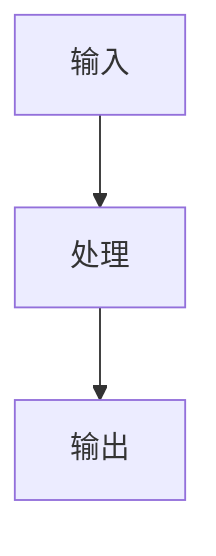

# 概念名称

## 🎯 核心定义
用简洁准确的语言定义这个概念

## 🏗️ 架构原理

### 基本结构
```
用 Mermaid 图表展示架构
```

### 工作流程


### 关键组件
1. **组件一**: 作用和功能
2. **组件二**: 作用和功能
3. **组件三**: 作用和功能

## 🔧 技术实现

### 核心算法
```python
# 伪代码或示例代码
def algorithm_name(input):
    # 算法实现
    pass
```

### 代码示例
```python
# 实际可运行的代码示例
```

### 配置选项
| 选项 | 类型 | 默认值 | 说明 |
|------|------|--------|------|
| option1 | string | "default" | 选项说明 |
| option2 | int | 10 | 选项说明 |

## 💼 FDE 应用场景

### 场景 1: 场景描述
**客户需求**: 客户的具体需求是什么

**FDE 分析**:
- **痛点**: 现有问题和挑战
- **机会**: 这个概念如何解决痛点
- **风险**: 可能遇到的风险和挑战

**实施策略**:
1. 策略一
2. 策略二
3. 策略三

**预期效果**: 期望达到的效果

### 场景 2: 场景描述
**客户需求**: 客户的具体需求是什么

**FDE 分析**:
- **痛点**: 现有问题和挑战
- **机会**: 这个概念如何解决痛点
- **风险**: 可能遇到的风险和挑战

**实施策略**:
1. 策略一
2. 策略二
3. 策略三

**预期效果**: 期望达到的效果

## ⚠️ 常见陷阱与解决方案

### 陷阱 1: 陷阱描述
**症状**: 出现什么问题

**原因分析**: 为什么会出现这个问题

**解决方案**:
1. 解决方法一
2. 解决方法二
3. 预防措施

### 陷阱 2: 陷阱描述
**症状**: 出现什么问题

**原因分析**: 为什么会出现这个问题

**解决方案**:
1. 解决方法一
2. 解决方法二
3. 预防措施

## 📊 性能优化

### 性能指标
- **延迟**: 具体的延迟指标
- **吞吐量**: 具体的吞吐量指标
- **资源消耗**: CPU/内存/磁盘使用

### 优化策略
1. **优化一**: 策略描述
2. **优化二**: 策略描述
3. **优化三**: 策略描述

## 🔗 相关知识

### 前置知识
- [[前置概念一]]
- [[前置概念二]]

### 相关概念
- [[相关概念一]]
- [[相关概念二]]

### 进阶主题
- [[进阶主题一]]
- [[进阶主题二]]

### 并行学习
- [[并行主题一]]
- [[并行主题二]]

## 📚 推荐资源

### 官方文档
- [文档名称](URL)

### 论文
- **论文标题**: 作者, 年份

### 工具/框架
- **工具名称**: [官方网站](URL)

### 实践项目
- **项目名称**: 简要描述

## 🎓 学习路径

### 入门级
1. 学习资源一
2. 学习资源二
3. 实践项目一

### 进阶级
1. 学习资源三
2. 学习资源四
3. 实践项目二

### 专家级
1. 学习资源五
2. 学习资源六
3. 实践项目三

## 🏷️ 标签系统
#概念 #技术 #{{分类}} #{{难度}}

---
**创建日期**: {{创建日期}}
**最后更新**: {{更新日期}}
**掌握程度**: 理论/实践/精通
**使用频率**: 高/中/低